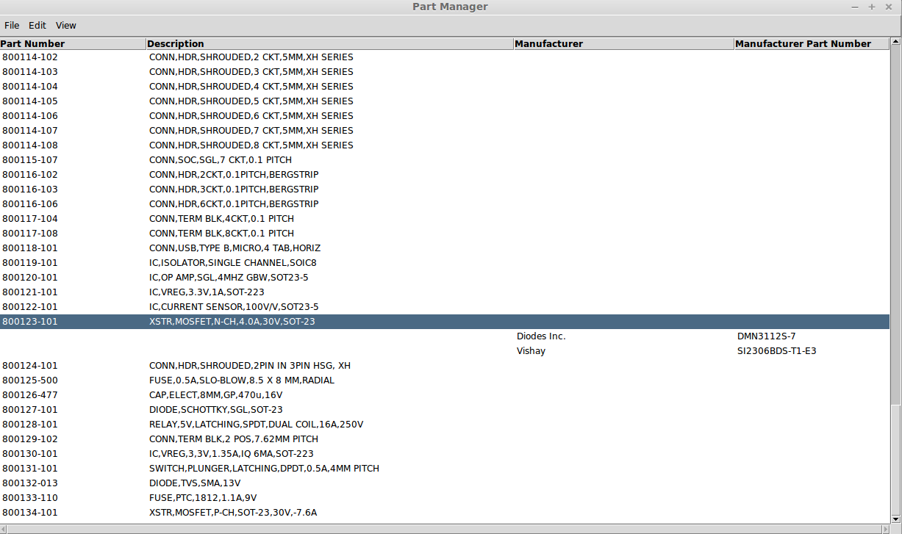
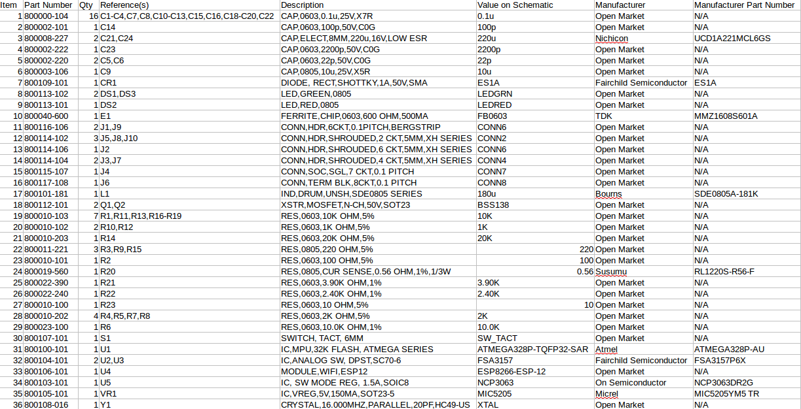
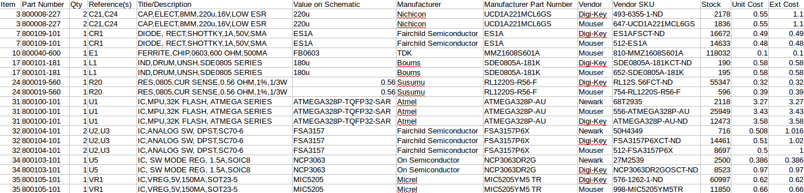

**BOMtools**
=========
This is a set of Python scripts for managing and costing parts in a Kicad or Eagle 6 schematic programs.
(other schematic capture packages may be supported in the future).

*Introduction*

This set of python scripts allows you to define your own part numbers
which can then reference a title/description and optionally single
or multiple manufacturers and manufacturer's part numbers.

The project consists of a BOM manager CLI script (bommgr.py) and
a Part Manager GUI (partmgr.py) script both of which are written in
Python 3, a BOM costing script written in Python 3,
and separate merger scripts for:
 
 * Kicad xml files written in Python 2.7.
 * Eagle 6 .csv files written in Python 3.0
 
Here is a screenshot of the GUI Part Manager tool partmgr.py:

*bommerge.py and bommerge-eagle.py* 

The merger script looks for a part number field in the Kicad xml file
or Eagle 6 csv file, and opens the sqlite database to look up other
relevant fields based on the part number. It then generates an
output .csv file with all of the relevant fields included.

Before you run the merge script:

1. Assign part numbers with bommgr.py or partmgr.py

2. For Kicad, you'll need to add a PartNumber field for each reference
designator on your schematic and include the new part number in
that field.

3. For Eagle, you'll need to add a PARTNUMBER attribute for each reference
designator on your schematic, bind the part numbers to the PARTNUMBER attribute
and check include attributes when exporting the .csv file.

Once the above steps are completed, you can run the merge program
by calling it from Kicad, or externally on the Eagle .csv file

The output will look like this when imported into your spreadsheet:

*bommgr.py*

Part numbers are expected to be in 6-3 format (e.g. 800000-101). You use
the manager script to add new part numbers like this:

`bommgr.py add part "XSTR,NPN,GP,50V"`

You will be prompted for confirmation.

Once confirmed, bommgr.py will automatically assign a new part number and spit it out
when it has been added to the database.

The only requirement for part number assignment
is the title/description, but there are other options available to
customize the new part number in the database.

You can override the part number and assign a custom part number with
the --specpn option. This is good for inputting tabulated part numbers
(i.e. a series of connectors).

You can specify a manufacturer with the --mfg option and a
manufacturer's part number with the --mpn option. For new parts entered
without these options, the default values will be used:

* "Open Market" for the manufacturer
* "N/A" for the manufacturer's part number

Other command line options are available to get the next part number to
be assigned, modify a title, list all the parts or manufacturers, query
by part number or manufacturer. Examples are shown below.

Command Examples:

`bommgr.py list parts`

Lists all parts in the database

`bommgr.py list parts --like RES%`

List all parts with a Title/Description beginning with RES

`bommgr.py add part --specpn 800123-101 "SCREWDRIVER,LEFT HANDED"`

Add a part with a part number specified in advance

`bommgr.py add part --mfg ACME --mpn ANVIL-01 "ANVIL, 100KG"`

Add a part with a Manufacturer and Manufacturer Part Number

*bomcost.py*

The bomcost script takes the csv file from BOMmerge and uses the Octopart
API to add vendor and cost columns for every part match returned by Octopart.
It then spits out a new csv file with the additional columns. 

The bomcost script uses a section bommgr.conf to set approved vendors, excluded
packaging (Such as custom reels), and the currency to quote the parts
in. See the sample bommgr.conf for details. Here is a sample of the costed 
output imported into a spreadsheet:

*partmgr.py*

This is a GUI part manager which displays parts in a list form
for ease of use during part number population of the schematic. It allows part
numbers and manufacturer part numbers to be pasted to the clipboard. It also allows
new parts to be added, descriptions to be changed, and manufacturer part
numbers to be changed. There is still quite a bit of functionality missing
which will require the use of the command line tool in some cases.

* Part numbers and descriptions are presented in list form.

* To see the manufacturers and manufacturer part numbers for a given part number, double click on the row.

* To edit a description, or add an alternate source, right click on a part number row.

* To edit a manufacturer part number, or remove an alternate source right click on an opened manufacturer row.

* New part numbers may be added using the Edit menu.

* To change a manufacturer name, choose 'View Manufacturers' from the View menu, then right click on
the manufacturer name to edit.

* You can associate a data sheet with a manufacturer's part number so that you can call up a datasheet
by right clicking on the manufacturer part number row and picking file name of the datasheet an a 
preconfigured datasheet directory. The pdf viewer path, and datasheet directory name need to be
placed in the bommgr.conf configuration file for this feature to work. See the sample bommgr.conf
file for details.

* You can copy a part number or manufacturer's part number to the clipboard by right clinking on the
row, them choosing the 'Copy part number to clipboard' or 'Copy manufacturer part number to clipboard'
menu items from the popup menu.

*Configuration File*

A configuration file is used to configure the behaviour of the scripts. Please refer to the the sample bommgr.conf
file in the bommgr directory for details.

*Configuration File Directory Search Order*

These scripts search for the configuration file "bommgr.conf" in the following order:

* Current working directory
* ~/.bommgr
* /etc/bommgr

*Database Generator*

Before running the parts manager or the merger scripts, the database will
need to be created. A separate script, "gendb.py" in the bommgr
directory does this. This script is not installed, and needs to be run manually in the directory where the database is going to be kept,
and the configuration file bommgr.conf needs to point to the location of the database file.

*Installation*

The standard python way of installation "setup.py" installs bommgr.py, bomcost.py, and partmgr.py. I typically install into my home directory
with the following command:

`python3 setup.py install --home ~`

The merger scripts do not have an installer associated with them.

The following python2.7 modules are required for bommerge.py:

* kicad_netlist_reader
* csv
* sqlite3
* argparse
* ConfigParser

The following python3 files are required for bommerge-eagle.py

* argparse
* configparser
* csv
* sqlite3

*Notice*

This is currently alpha software. There will most likely be bugs. This is not feature complete. There
are several important commands missing. There is no facility to delete part numbers once they have been
assigned, and there probably never will be as that is dangerous. 

Use at your own risk.

Feedback is appreciated.

